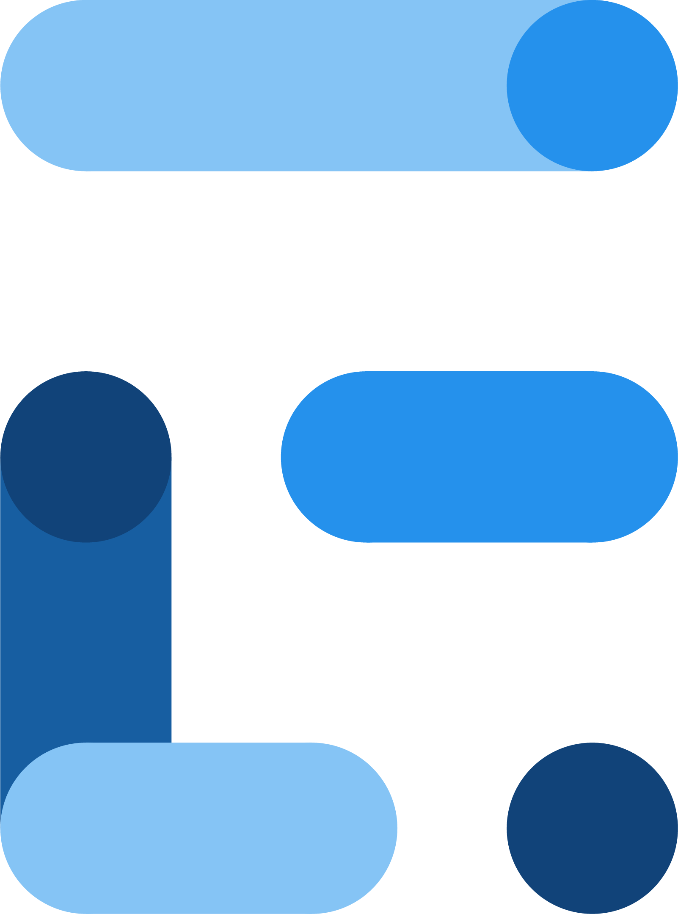

<h1 align="left">Hey 👋 What's up?</h1>

###

My name is Deepak Mahalingam and I'm Senior SDET based out in Berlin, Germany

###

<h2 align="left">About me</h2>

###

 Automation specialist skilled in designing scalable test automation frameworks across web, mobile, and API layers using a wide range of tools. 

🌍  I'm based in Berlin, Germany 🖥️  See my portfolio at https://www.deepakmahalingam.com ✉️  You can contact me at deepanm1209@gmail.com 

###

<h2 align="left">Tools I use</h2>

###

  
  
  
  
  
  
  
  
  
  
  
  
  
  
  
  
  
  
  
  
  
  
  
  
  
  
  
  
  
  
  
  
  
  
  
  

###
